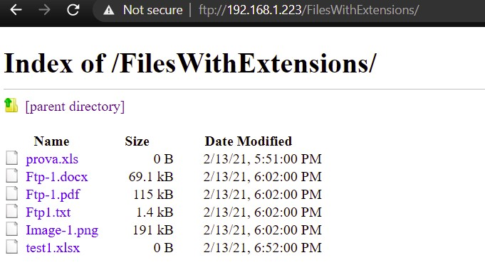

# FTP_Folder

Zhvillimi i aplikacionit që mundeson qe fajllat me ekstension .doc, .docx, .xls, .xlsx në një folder të caktuar të ngarkohen në një FTP server të caktuar duke përdorur modulin tkinter të Python.

## Teknologjia e perdorur

- Sistemi Operativ - Windows 10 Pro
- Gjuha Programuese - Python

## Përshkrimi

Në këtë detyrë, kemi shqyrtuar se si të përdorim FTP me Python për të dërguar dhe marrë skedarë nga një server përmes lidhjeve TCP/IP.

Për t'i bërë gjërat më të lehta dhe më abstrakte, ne kemi përdorur librarite tkinter dhe ftplib të Python të cilat ofrojnë një sërë funksionesh që e bëjnë më të lehtë punën me FTP. Ne do të shohim zbatimin për ngarkimin dhe shkarkimin e skedarëve nga serveri, si dhe disa gjëra të tjera interesante që "tkinter" dhe "ftplib" na lejojnë të bëjmë.

## Çfarë është FTP?

FTP është një protokoll standard i rrjetit që përdoret për transferimin e skedarëve midis një klienti dhe serverit në një rrjet kompjuterik. FTP është një protokoll shumë i mirë-vendosur, i zhvilluar në vitet 1970 për të lejuar dy kompjuterë të transferojnë të dhëna në internet. Një kompjuter vepron si server për të ruajtur informacionin dhe tjetri vepron si klient për të dërguar ose kërkuar skedarë nga serveri. Protokolli FTP zakonisht përdor portin 21 si mjetin e tij kryesor të komunikimit. Një server FTP do të dëgjojë për lidhjet e klientit në portin 21.

## Puna me FTP dhe GUI ne Python

Modulin tkinter e kemi përdorur për të krijuar UI ndërsa me modulin ftplib kemi trajtuar navigimin/komandat e serverit.
Moduli ftplib është një librari e integruar që vjen tashmë e instaluar me Python, gjithçka që duhet të bëni është ta importoni në skenarin tuaj dhe mund të filloni të përdorni funksionet e tij. Për ta importuar atë, përdorni komandën e mëposhtme:

> `from ftplib import FTP`  

Pas kësaj, duhet të fillojmë një lidhje me serverin FTP me të cilin duam të hapim një lidhje komunikimi. Për ta bërë këtë, krijoni një shembull ftp:

> `with ftp.FTP() as ftp_cx:`   > `ftp_cx.connect(ftp_host, ftp_port)`   > `ftp_cx.login(ftp_user, ftp_pass)`  

Funksioni connect() merr hostin dhe portin dhe fillon një sesion me serverin.

Pastaj, login() merr një emër të përdoruesit dhe fjalëkalimin dhe përpiqet të vërtetojë sesionin tonë. Nëse kredencialet tona verifikohen, ne kemi hyrë në server dhe mund të fillojmë të dërgojmë më shumë komanda; nëse jo, një kundërshtim error_perm do të shfaqet. 

### Shkarkimi i skedarëve

Shkarkimi i skedarëve nga një server FTP përfshin njërën nga metodat retrbinary(). Ashtu si storbinary(), secila metodë merr një varg komande si argumentin e saj të parë, por në këtë rast duhet të jetë një komandë e vlefshme RETR (zakonisht "RETR filename" do të mjaftojë).

Argumenti i dytë është një funksion i kthimit prapa i cili do të thirret në çdo pjesë për retrbinary(). Kjo thirrje mund të përdoret për të ruajtur të dhënat e shkarkuara.

> `ftp.retrbinary("RETR " + file, down.write)`  

 

### Ngarkimi i skedarëve

Për të ngarkuar në të vërtetë një skedar, ne përdorim metodën storbinary():

> `filename = path.basename(filepath)`   > `with open(filepath, 'rb') as fh:`   > `ftp_cx.storbinary('STOR {}'.format(filename), fh)`  

Për të dërguar skedarin, ne duhet ta hapim atë në modalitetin e leximit binar, pastaj thirrim komanden storbinary(). Argumenti i parë "STOR" në storbinary është një komandë e vlefshme e FTP-se , zakonisht shenohet STOR pastaj emri i skedarit, pra "STOR filename" ku "filename" është ajo që dëshironi të quhen të dhënat e ngarkuara në server.

Argumenti i dytë është vetë objekti i skedarit. Kjo duhet të hapet në modalitetin binar pasi që ne po e dërgojmë atë si të dhëna binare. Kjo mund të duket e çuditshme pasi skedari CSV që po dërgojmë është në thelb një skedar teksti i thjeshtë, por dërgimi i tij si të dhëna binare garanton që serveri nuk do ta ndryshojë skedarin në asnjë mënyrë gjatë transportimit; kjo është pothuajse gjithmonë ajo që ne dëshirojmë kur transferojmë skedarë, pavarësisht nga natyra e të dhënave që shkëmbehen.

 

### Listimi i skedarëve

Metoda që kemi përdorur për renditjen e skedarëve në një server FTP është nlst (), e cila korrespondon me komandën e vjetër NLST.
Metoda pranon një numër arbitrar të argumenteve që do t'i bashkangjiten fjalë për fjalë vargut të komandës në server.

> `dirlist = ftp.nlst()`  

### Fshirja e skedarëve

Fshirja e skedarëve duke përdorur ftplib është shumë e thjeshtë. Metoda delete() merr vetëm një emër skedari dhe përpiqet të fshijë skedarin e dhënë në server.

Natyrisht, suksesi i metodës varet nga lejet e dhëna në llogarinë e përdorur për tu kyçur.

> `ftp.rmd(directory)`

### Krijimi i directory-it

Një directory krijohet me metodën mkd(). Ky operacion kërkon një llogari përdoruesi me privilegje të mjaftueshme; nuk është në dispozicion me llogari anonime.

> `ftp.mkd(directory)`

 

<!-- 

 -->

### Ndryshimi i path-it

Metoda cwd() ndryshon directory-n aktual të punës.

> `ftp.cwd(directory)`  

### Kujdes!

Është e rëndësishme të theksohet se ndërsa FTP është mjaft i sigurt vetë, ai nuk përdoret zakonisht për të transferuar informacione të ndjeshme; nëse po transferoni diçka të tillë, atëherë duhet të shikoni për mundësi më të sigurta si SFTP (Secure FTP) ose SSH (Secure Shell). Këto janë protokollet më të përdorura për trajtimin e transmetimit të të dhënave të ndjeshme.

### Përfundim

Në këtë post, ne diskutuam se çfarë është FTP dhe si funksionon me ndihmën e shembujve të ndryshëm. Ne gjithashtu pamë se si të përdorim modulet "tkinter" dhe "ftplib" të Python për të komunikuar me një server të largët duke përdorur FTP dhe pamë disa funksione të tjera që ofrojn këto module. Në fund, ne diskutuam gjithashtu disa alternativa më të sigurta për FTP, të tilla si SFTP dhe SSH, të cilat përdoren për transferimin e informacionit të ndjeshëm.
